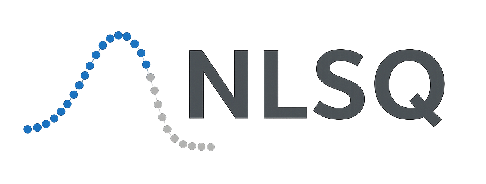

<div align="center">
</img>
</div>

# NLSQ: Nonlinear Least Squares Curve Fitting for GPU/TPU

**Note:** NLSQ is forked from [JAXFit](https://github.com/Dipolar-Quantum-Gases/JAXFit) with significant optimizations and improvements.

[](https://badge.fury.io/py/nlsq)
[](https://nlsq.readthedocs.io/en/latest/?badge=latest)
[](https://www.python.org/downloads/)
[](https://github.com/google/jax)

[**Quickstart**](#quickstart-colab-in-the-cloud)
| [**Install guide**](#installation)
| [**ArXiv Paper**](https://doi.org/10.48550/arXiv.2208.12187)
| [**Documentation**](https://nlsq.readthedocs.io/)
| [**Examples**](examples/)

## What is NLSQ?

NLSQ is a fork of JAXFit that implements SciPy's nonlinear least squares curve fitting algorithms using [JAX](https://jax.readthedocs.io/en/latest/notebooks/quickstart.html) for GPU/TPU acceleration. This fork includes significant optimizations, enhanced testing, and improved API design. Fit functions are written in Python without CUDA programming. Performance improvements over SciPy/Gpufit are documented in [this paper](https://doi.org/10.48550/arXiv.2208.12187).

NLSQ uses JAX's [automatic differentiation](https://jax.readthedocs.io/en/latest/notebooks/autodiff_cookbook.html) to calculate Jacobians automatically, eliminating the need for manual partial derivatives or numerical approximation.


NLSQ provides a drop-in replacement for SciPy's curve_fit function with the following features:

- **GPU/TPU acceleration** via JAX JIT compilation
- **Automatic differentiation** for Jacobian calculation
- **Trust Region Reflective** and **Levenberg-Marquardt** algorithms
- **Bounded optimization** with parameter constraints
- **Robust loss functions** for outlier handling
- **Large dataset support** for 20M+ points with automatic memory management
- **Sparse Jacobian optimization** for problems with sparse structure
- **Streaming optimizer** for unlimited-size datasets
- **Memory-efficient solvers** (CG, LSQR) for reduced memory footprint
- **Fixed array size optimization** to avoid recompilation
- **Comprehensive test coverage** (>80%) ensuring reliability

## Basic Usage

```python
import numpy as np
from nlsq import CurveFit


# Define your fit function
def linear(x, m, b):
    return m * x + b


# Prepare data
x = np.array([0, 1, 2, 3, 4, 5, 6, 7, 8, 9, 10])
y = np.array([0, 2, 4, 6, 8, 10, 12, 14, 16, 18, 20])

# Perform the fit
cf = CurveFit()
popt, pcov = cf.curve_fit(linear, x, y)
print(f"Fitted parameters: m={popt[0]:.2f}, b={popt[1]:.2f}")
```

NLSQ leverages JAX's just-in-time (JIT) compilation to [XLA](https://www.tensorflow.org/xla) for GPU/TPU acceleration.
Fit functions must be JIT-compilable. For functions using special operations, use JAX's numpy:

```python
import jax.numpy as jnp
import numpy as np
from nlsq import CurveFit


# Define exponential fit function using JAX numpy
def exponential(x, a, b):
    return jnp.exp(a * x) + b


# Generate synthetic data
x = np.linspace(0, 4, 50)
y_true = np.exp(0.5 * x) + 2.0
y = y_true + 0.1 * np.random.normal(size=len(x))

# Fit with initial guess
cf = CurveFit()
popt, pcov = cf.curve_fit(exponential, x, y, p0=[0.5, 2.0])
print(f"Fitted: a={popt[0]:.3f}, b={popt[1]:.3f}")

# Get parameter uncertainties from covariance
perr = np.sqrt(np.diag(pcov))
print(f"Uncertainties: σ_a={perr[0]:.3f}, σ_b={perr[1]:.3f}")
```


For more complex fit functions there are a few JIT function caveats (see [Current gotchas](#current-gotchas)) such as avoiding control code within the fit function (see [JAX's sharp edges](https://jax.readthedocs.io/en/latest/notebooks/Common_Gotchas_in_JAX.html)
article for a more in-depth look at JAX specific caveats).


### Contents
* [Quickstart: Colab in the Cloud](#quickstart-colab-in-the-cloud)
* [Large Dataset Support](#large-dataset-support)
* [Current gotchas](#current-gotchas)
* [Installation](#installation)
* [Citing NLSQ](#citing-nlsq)
* [Reference documentation](#reference-documentation)

## Quickstart: Colab in the Cloud
The easiest way to test out NLSQ is using a Colab notebook connected to a Google Cloud GPU. JAX comes pre-installed so you'll be able to start fitting right away.

Tutorial notebooks:
- [The basics: fitting basic functions with NLSQ](https://colab.research.google.com/github/Dipolar-Quantum-Gases/nlsq/blob/main/examples/NLSQ%20Quickstart.ipynb)
- [Fitting 2D images with NLSQ](https://colab.research.google.com/github/Dipolar-Quantum-Gases/nlsq/blob/main/examples/NLSQ%202D%20Gaussian%20Demo.ipynb)
- [Large dataset fitting demonstration](https://colab.research.google.com/github/Dipolar-Quantum-Gases/nlsq/blob/main/examples/large_dataset_demo.ipynb)

## Large Dataset Support

NLSQ includes advanced features for handling very large datasets (20M+ points) that may not fit in memory:

### Automatic Memory Management

```python
from nlsq import LargeDatasetFitter, estimate_memory_requirements
import numpy as np

# Check memory requirements for your dataset
n_points = 50_000_000  # 50 million points
n_params = 3
stats = estimate_memory_requirements(n_points, n_params)
print(f"Memory required: {stats.total_memory_estimate_gb:.2f} GB")
print(f"Recommended chunks: {stats.n_chunks}")

# Automatic chunking for large datasets
fitter = LargeDatasetFitter(memory_limit_gb=4.0)  # 4GB memory limit

# Generate large dataset
x = np.linspace(0, 10, n_points)
y = 2.0 * np.exp(-0.5 * x) + 0.3 + np.random.normal(0, 0.05, n_points)


# Fit with automatic memory management
def exponential(x, a, b, c):
    return a * np.exp(-b * x) + c


result = fitter.fit(exponential, x, y, p0=[2.5, 0.6, 0.2])
print(f"Fitted parameters: {result.popt}")
```

### Convenience Function for Large Datasets

```python
from nlsq import fit_large_dataset

# Simple API for large dataset fitting
result = fit_large_dataset(
    exponential,
    x,
    y,
    p0=[2.5, 0.6, 0.2],
    memory_limit_gb=4.0,
    show_progress=True,  # Progress bar for long fits
)
```

### Sparse Jacobian Optimization

For problems with sparse Jacobian structure (e.g., fitting multiple independent components):

```python
from nlsq import SparseJacobianComputer

# Automatically detect and exploit sparsity
sparse_computer = SparseJacobianComputer(sparsity_threshold=0.01)
sparsity_pattern = sparse_computer.detect_sparsity(func, x_sample, p0)

if sparse_computer.is_sparse(sparsity_pattern):
    print(
        f"Jacobian is {sparse_computer.compute_sparsity_ratio(sparsity_pattern):.1%} sparse"
    )
    # Optimization will automatically use sparse methods
```

### Streaming Optimizer for Unlimited Datasets

For datasets that don't fit in memory or are generated on-the-fly:

```python
from nlsq import StreamingOptimizer, StreamingConfig

# Configure streaming optimization
config = StreamingConfig(batch_size=10000, max_epochs=100, convergence_tol=1e-6)

optimizer = StreamingOptimizer(config)

# Stream data from file or generator
result = optimizer.fit_unlimited_data(func, data_generator, x0=p0, n_params=3)
```

### Key Features for Large Datasets:

- **Memory Estimation**: Predict memory requirements before fitting
- **Automatic Chunking**: Split large datasets into manageable chunks
- **Progress Reporting**: Track progress during long-running fits
- **Sparse Optimization**: Exploit sparsity in Jacobian matrices
- **Streaming Support**: Process data that doesn't fit in memory
- **Memory-Efficient Solvers**: CG and LSQR solvers for reduced memory usage

For more details, see the [large dataset guide](https://nlsq.readthedocs.io/en/latest/large_datasets.html) and [API documentation](https://nlsq.readthedocs.io/en/latest/api.html).

## Current gotchas

Full disclosure we've copied most of this from the [JAX repo](https://github.com/google/jax#current-gotchas), but NLSQ inherits
JAX's idiosyncrasies and so the "gotchas" are mostly the same.

### Double precision required
NLSQ requires double precision (64-bit, `float64`) for numerical stability. By default, JAX uses single precision (32-bit, `float32`).

NLSQ **automatically enables double precision** when imported. However, if you import JAX before NLSQ, you must enable it manually:

```python
# If importing JAX first (not recommended)
from jax import config

config.update("jax_enable_x64", True)

import jax.numpy as jnp
from nlsq import CurveFit

# Recommended: Import NLSQ first (auto-enables double precision)
from nlsq import CurveFit
import jax.numpy as jnp
```

### Other caveats
Below are some more things to be careful of, but a full list can be found in [JAX's Gotchas
Notebook](https://jax.readthedocs.io/en/latest/notebooks/Common_Gotchas_in_JAX.html).
Some standouts:

1. JAX transformations only work on [pure functions](https://en.wikipedia.org/wiki/Pure_function), which don't have side-effects and respect [referential transparency](https://en.wikipedia.org/wiki/Referential_transparency) (i.e. object identity testing with `is` isn't preserved). If you use a JAX transformation on an impure Python function, you might see an error like `Exception: Can't lift Traced...`  or `Exception: Different traces at same level`.
1. [In-place mutating updates of arrays](https://jax.readthedocs.io/en/latest/notebooks/Common_Gotchas_in_JAX.html#in-place-updates), like `x[i] += y`, aren't supported, but [there are functional alternatives](https://jax.readthedocs.io/en/latest/jax.ops.html). Under a `jit`, those functional alternatives will reuse buffers in-place automatically.
1. Some transformations, like `jit`, [constrain how you can use Python control flow](https://jax.readthedocs.io/en/latest/notebooks/Common_Gotchas_in_JAX.html#control-flow). You'll always get loud errors if something goes wrong. You might have to use [jit's static_argnums parameter](https://jax.readthedocs.io/en/latest/jax.html#just-in-time-compilation-jit), [structured control flow primitives](https://jax.readthedocs.io/en/latest/jax.lax.html#control-flow-operators) like [lax.scan](https://jax.readthedocs.io/en/latest/_autosummary/jax.lax.scan.html#jax.lax.scan).
1. Some of NumPy's dtype promotion semantics involving a mix of Python scalars and NumPy types aren't preserved, namely `np.add(1, np.array([2], np.float32)).dtype` is `float64` rather than `float32`.
1. If you're looking for [convolution operators](https://jax.readthedocs.io/en/latest/notebooks/convolutions.html), they're in the `jax.lax` package.


## Installation

### Requirements

- **Python 3.12 or higher** (3.13 also supported)
- **JAX 0.4.20 - 0.7.2** (tested with latest versions)
- **NumPy 1.26.0+**
- **SciPy 1.11.0+**

### Quick Install

#### Linux/Mac (Recommended)

```bash
# For CPU-only
pip install --upgrade "jax[cpu]>=0.4.20" nlsq

# For GPU with CUDA 12
pip install --upgrade "jax[cuda12]>=0.4.20" nlsq
```

#### Development Installation

```bash
git clone https://github.com/Dipolar-Quantum-Gases/nlsq.git
cd nlsq
pip install -e ".[dev,test,docs]"
```

### Platform-Specific Installation

For detailed installation instructions including Windows support and CUDA configuration, see below.

### Windows Installation

Windows users have several options for installing JAX:

#### Option 1: WSL2 (Recommended)

Use Windows Subsystem for Linux 2 (WSL2) and follow the Linux installation instructions above.

#### Option 2: Native Windows with CPU

```bash
# Create a Python 3.12+ environment
conda create -n nlsq python=3.12
conda activate nlsq

# Install JAX CPU version (latest compatible)
pip install "jax[cpu]>=0.4.20"
pip install nlsq
```

#### Option 3: Native Windows with GPU (CUDA 12)

```bash
# Ensure you have CUDA 12.x installed
# Create environment
conda create -n nlsq python=3.12
conda activate nlsq

# Install CUDA toolkit
conda install -c conda-forge cuda-toolkit=12.1

# Install JAX with CUDA support (latest compatible)
pip install "jax[cuda12_local]>=0.4.20"
pip install nlsq
```

For the latest JAX installation instructions, see the [official JAX documentation](https://jax.readthedocs.io/en/latest/installation.html).

<!--For more detail on using these pre-built wheels please see the docs.-->


## Citing NLSQ

If you use NLSQ consider citing the [introductory paper](https://doi.org/10.48550/arXiv.2208.12187):

```bibtex
@article{nlsq2022,
  title={NLSQ: Trust Region Method for Nonlinear Least-Squares Curve Fitting on the {GPU}},
  author={Hofer, Lucas R and Krstaji{\'c}, Milan and Smith, Robert P},
  journal={arXiv preprint arXiv:2208.12187},
  year={2022},
  url={https://doi.org/10.48550/arXiv.2208.12187}
}
```


## Reference documentation

For details about the NLSQ API, see the
[reference documentation](https://nlsq.readthedocs.io/).
